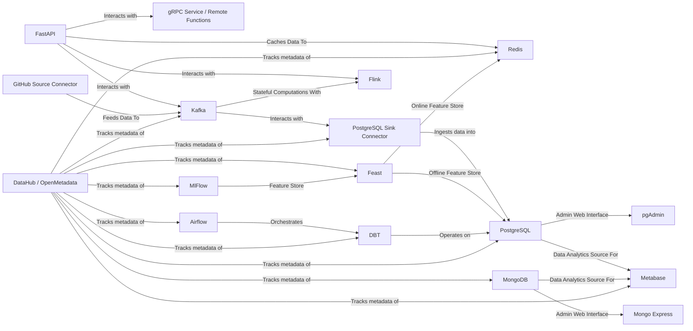

# Foehammer's Tech-Terrarium

Foehammer's Tech-Terrarium is a comprehensive ecosystem of services designed for testing, learning, and development
purposes. The project aims to simulate a tech stack in a small local environment, providing a hands-on experience with
various tools and technologies.

There are some coded applications within this environment, we chose to implement them in Python for simplicity and speed
to deployment, but the idea is that any Python app here could be re-written in another language.

> NOTE: This Mermaid diagram was generated with the help of Copilot 😊

## Usage

TODO: Add usage instructions (makefile and manual running and whatnot)

## Services

TODO: make subsections for each service here

## TODO

- [ ] set up a mkdocs site to document the terrarium
    - add mermaid diagram(s) of the services in the project showing how they interact with each other
- [ ] add pre-commit checks to the project
- [ ] set up the FastAPI to utilize redis caching so that we can see data moving into redis and then utilize that data
  elsewhere
- [ ] gRPC service that can be interacted with from the FastAPI app. this would be a hello world like service to
  demo how it might work.
- [ ] set up a project homepage using [Homepage](https://github.com/gethomepage/homepage) or something similar to make a
  single point of entry for all the services in the Terrarium.
- [ ] setup dashboarding/tracking of the terrarium
    - thinking of using InfluxDB since it's so easy to set up and versatile and can plug into prom endpoints and has a
      TON of integrations for monitoring.
- [ ] Kafka Connectors
    - [PostgreSQL Sink](https://docs.confluent.io/cloud/current/connectors/cc-postgresql-sink.html)
    - [GitHub Source](https://docs.confluent.io/cloud/current/connectors/cc-github-source.html)
        - would be neat to have this project be able to track change to itself from GitHub and any/all supporting
          projects (i.e. postgres,confluent,fastapi,etc. repos)
- [ ] Set up Flink
    - https://flink.apache.org/
    - https://docs.confluent.io/cloud/current/flink/overview.html
    - would be neat to see if it's possible or how much effort it would be to set up a GraphQL interface to Flink to
      enable querying of kafka data from a web client. but really just want to get a little more familiar with Flink as
      I've seen it referenced a few times now from large sources (i.e. Confluent)
- [ ] setup example python snypits in the kafka directory
    - basic dict/pydantic producer
    - avro producer (using pydantic)
    - basic consumer
    - avro consumer
    - async usage example
- [ ] set up a Makefile to make it easier to run the services and start the Terrarium, parts of the terrarium.
- [ ] build out the airflow instance with DAG's that perform scheduled operations on the rest of the terrarium
    - implement a DBT repo/project to be orchestrated by airflow
- [ ] setup metabase with some default dashboards for the terrarium
- [ ] dig deeper into MlFlow to expand knowledge and experience with building and releasing models.
    - might be worth setting up a feast repo/project for online/offline features stores for a model utilizing postgres
      and redis for practice.
- [ ] set up a Spark server and explore that more
    - follow the quick start guide to get a feel for it and operate on local files (testing parquet, csv, json, avro,
      etc.)
    - see about setting up apache iceberg locally and having Spark operate on it.
- [ ] implement DataHub to track metadata of the terrarium
    - would also not be a terrible idea to set up an instance of openmetadata as well.

## Dropped Services

- Trino
    - Reason: it's been giving me nothing but challenges and didn't just work out of the box with kafka, which was a
      main goal for me. will take a look at using flink next for stream processing. Definatly a nice tool, but the
      given the overhead of setting it up, it's not worth it for this project, and would be a tough to consider
      pushing for in an enterprise environment without a clear need (don't need a solution looking for a problem).