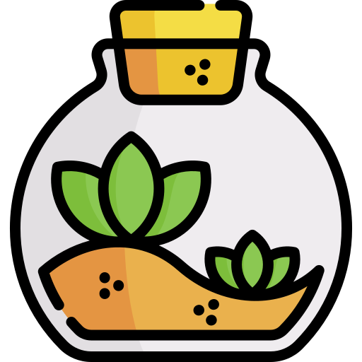
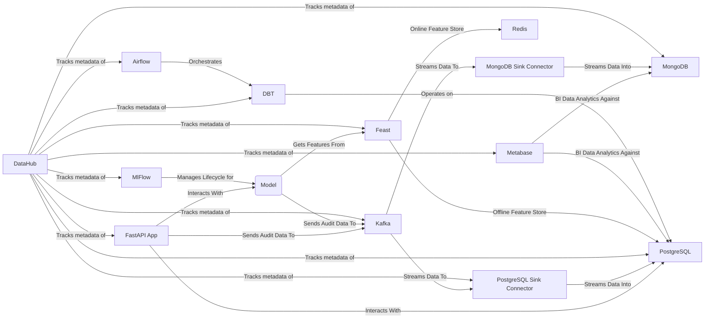

  

# Tech-Terrarium

**Documentation**:
<a href="https://foehammer82.github.io/tech-terrarium/" target="_blank">https://foehammer82.github.io/tech-terrarium/</a>

**Source Code**:
<a href="https://github.com/Foehammer82/tech-terrarium" target="_blank">https://github.com/Foehammer82/tech-terrarium</a>

The Tech-Terrarium is a compact, hands-on tech stack simulation for learning and development. It features Python
applications for quick deployment, but they can be re-written in other languages.

## Motivation

I have often found myself digging through past projects to look up how different implementations were accomplished or
to reference a past approach. I have also commonly found myself re-researching the same things over and over again
throughout both personal and professional projects. Enter the `Tech-Terrarium`. This project is mostly for my own
benefit to be able to quickly spin up, look at, and play with different approaches to Data Engineering and Software
Engineering problems. And, if this helps someone else along the way, then that's a bonus!

That said, if you do find yourself here and have questions, comments, feedback, or suggestions, please feel free to
reach out or start create an `Issue` or `Pull Request`. And, this should go without saying, but please be
respectful and considerate when making comments or suggestions.

## Project Architecture

## MVP Roadmap

- [x] set up a mkdocs site to document the terrarium
- [x] add pre-commit checks to the project
- [x] set up a Makefile to make it easier to run the services and start the Terrarium, parts of the terrarium.
- [x] set up a project homepage using [Homepage](https://github.com/gethomepage/homepage) or something similar to make a
  single point of entry for all the services in the Terrarium.
- [x] Kafka Connectors
    - [PostgreSQL Sink](https://docs.confluent.io/cloud/current/connectors/cc-postgresql-sink.html)
    - [MongoDB Sink](https://www.mongodb.com/docs/kafka-connector/current/sink-connector/configuration-properties/all-properties/)
- [x] setup metabase with some default dashboards for the terrarium
- [x] implement DataHub to track metadata of the terrarium
- [ ] implement a DBT project to be orchestrated by airflow that does some operations on data within postgres
    - have it both generate and operate on data that it creates and uses and have it operate on datagen data being
      produced from kafka
- [ ] setup example python documentation examples to demonstrate interactions with kafka
- [ ] build out the airflow instance with DAG's that perform scheduled operations on the rest of the services in the
  terrarium
- [ ] set up a Spark server and explore that more
    - follow the quick start guide to get a feel for it and operate on local files (testing parquet, csv, json, avro,
      etc.)
    - see about setting up apache iceberg locally and having Spark operate on it.
- [ ] implement openmetadata with the same setup as datahub
- [ ] create some endpoints in the FastAPI app that query topics using KSQL
- [ ] deploy a model using MLFlow and serve basic features to it from feast
    - deploy the model as a FastAPI app, and/or as an RPC service, that the main FastAPI app can interact with
- [ ] get an example built on top of the fastapi app that uses [arq](https://arq-docs.helpmanual.io/) for RPC to show
  another way besides FastAPI to interact between apps. though have it in the FastAPI app so we can use the Swagger UI
  to trigger the RPC calls.
- [ ] look into getting examples for [FastUI](https://github.com/pydantic/FastUI) since it uses React and FastAPI to
  build front ends

## Long Term

- [ ] configure all exposed services to run through a Traefik load balancer
    - this would be a good exercise in setting up a reverse proxy and load balancer for the terrarium
- [ ] configure to run everything on kubernetes with helm. the goal is to see if the whole stack can be deployed on 3
  raspberry pi's using k3s.
    - write docs and instructions on setting up the hardware
    - write docs and instructions on setting up the k3s cluster
    - write docs and instructions for deploying the stack on the cluster

## Credits

- Terrarium Icon: <a href="https://www.flaticon.com/free-icons/terrarium" title="terrarium icons">Terrarium icons
  created by Freepik - Flaticon</a>