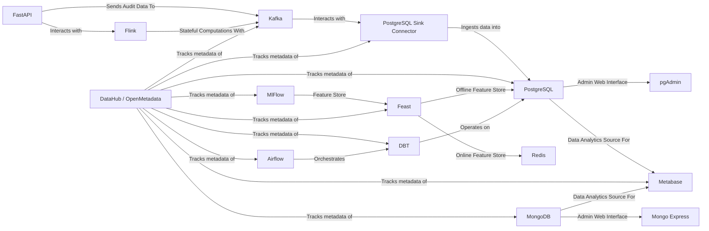

  

# Tech-Terrarium

**Documentation**:
<a href="https://tech-terrarium.foehammer.dev/" target="_blank">https://tech-terrarium.foehammer.dev/</a>

**Source Code**:
<a href="https://github.com/Foehammer82/tech-terrarium" target="_blank">https://github.com/Foehammer82/tech-terrarium</a>

The Tech-Terrarium is a compact, hands-on tech stack simulation for learning and development. It features Python
applications for quick deployment, but they can be re-written in other languages.

## Motivation

I have often found myself digging through past projects to look up how different implementations were accomplished or
to reference a past approach. I have also commonly found myself re-researching the same things over and over again
throughout both personal and professional projects. Enter the `Tech-Terrarium`. This project is mostly for my own
benefit to be able to quickly spin up, look at, and play with different approaches to Data Engineering and Software
Engineering problems. And, if this helps someone else along the way, then that's a bonus!

That said, if you do find yourself here and have questions, comments, feedback, or suggestions, please feel free to
reach out or start create an `Issue` or `Pull Request`. And, this should go without saying, but please be
respectful and considerate when making comments or suggestions.

## Project Architecture

## MVP Roadmap

- [x] set up a mkdocs site to document the terrarium
- [x] add pre-commit checks to the project
- [x] set up a project homepage using [Homepage](https://github.com/gethomepage/homepage) or something similar to make a
  single point of entry for all the services in the Terrarium.
- [x] Kafka Connectors
    - [PostgreSQL Sink](https://docs.confluent.io/cloud/current/connectors/cc-postgresql-sink.html)
    - [MongoDB Sink](https://www.mongodb.com/docs/kafka-connector/current/sink-connector/configuration-properties/all-properties/)
- [ ] Set up Flink
    - https://flink.apache.org/
    - https://docs.confluent.io/cloud/current/flink/overview.html
    - would be neat to see if it's possible or how much effort it would be to set up a GraphQL interface to Flink to
      enable querying of kafka data from a web client. but really just want to get a little more familiar with Flink as
      I've seen it referenced a few times now from large sources (i.e. Confluent)
- [ ] setup example python snippets in the kafka directory
    - basic dict/pydantic producer
    - avro producer (using pydantic)
    - basic consumer
    - avro consumer
    - async usage example
- [x] set up a Makefile to make it easier to run the services and start the Terrarium, parts of the terrarium.
- [ ] set up an open-metadata instance to compare it against DataHub
- [ ] build out the airflow instance with DAG's that perform scheduled operations on the rest of the terrarium
    - implement a DBT repo/project to be orchestrated by airflow
- [ ] setup metabase with some default dashboards for the terrarium
    - note, if there isn't a way to have the project create defaults on container start, just write instructions for how
      to build some basic dashboards. but it would be SUPER slick to have a way to do it automatically.
- [ ] dig deeper into MlFlow to expand knowledge and experience with building and releasing models.
    - might be worth setting up a feast repo/project for online/offline features stores for a model utilizing postgres
      and redis for practice.
- [ ] set up a Spark server and explore that more
    - follow the quick start guide to get a feel for it and operate on local files (testing parquet, csv, json, avro,
      etc.)
    - see about setting up apache iceberg locally and having Spark operate on it.
- [ ] implement DataHub to track metadata of the terrarium
    - would also not be a terrible idea to set up an instance of openmetadata as well.

## Long Term

- [ ] configure all exposed services to run through a Traefik load balancer
    - this would be a good exercise in setting up a reverse proxy and load balancer for the terrarium
- [ ] configure to run everything on kubernetes with helm. the goal is to see if the whole stack can be deployed on 3
  raspberry pi's using k3s.
    - write docs and instructions on setting up the hardware
    - write docs and instructions on setting up the k3s cluster
    - write docs and instructions for deploying the stack on the cluster

## Credits

- Terrarium Icon: <a href="https://www.flaticon.com/free-icons/terrarium" title="terrarium icons">Terrarium icons
  created by Freepik - Flaticon</a>