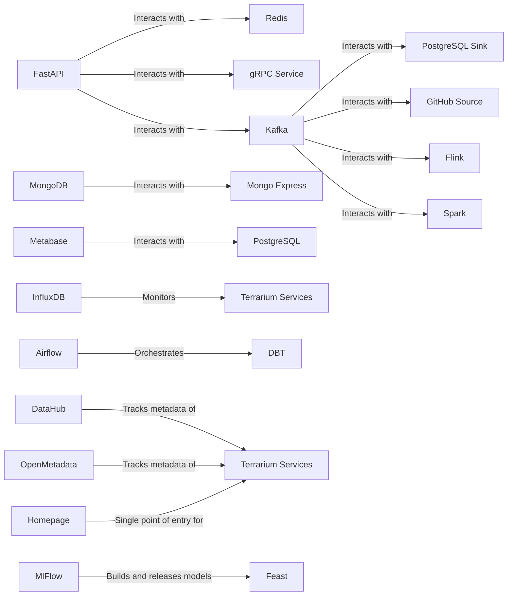

# Diagrams

In this diagram:

- FastAPI interacts with Redis, gRPC Service, and Kafka.
- Kafka interacts with PostgreSQL Sink, GitHub Source, Flink, and Spark.
- MongoDB interacts with Mongo Express.
- Metabase interacts with PostgreSQL.
- InfluxDB monitors all the services in the Terrarium.
- Airflow orchestrates DBT.
- DataHub and OpenMetadata track metadata of all the services in the Terrarium.
- MlFlow builds and releases models with Feast.
- Homepage serves as a single point of entry for all the services in the Terrarium.

Please note that this is a basic diagram and the actual interactions might be more complex depending on the specific
implementation of each service.