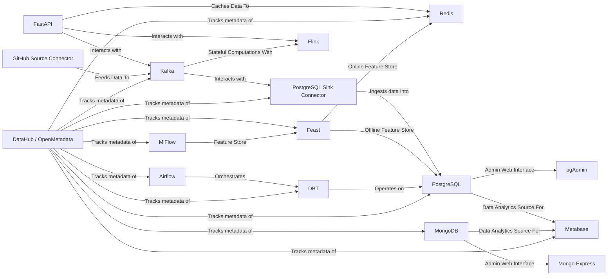

# Tech-Terrarium

!!! note

    move this project fully to github, and have it mirrored to gitlab

**Documentation**:
<a href="https://tech-terrarium.foehammer.dev/" target="_blank">https://tech-terrarium.foehammer.dev/</a>

**Source Code**:
<a href="https://github.com/Foehammer82/tech-terrarium" target="_blank">https://github.com/Foehammer82/tech-terrarium</a>

The Tech-Terrarium is a compact, hands-on tech stack simulation for learning and development. It features Python
applications for quick deployment, but they can be re-written in other languages.

The project includes services like FastAPI, Redis, Kafka, PostgreSQL, Flink, MongoDB, Airflow, DBT,
DataHub/OpenMetadata, MlFlow, and Feast. FastAPI is used for building APIs, Kafka for real-time data
streaming, and PostgreSQL for data storage. Flink is used for stateful computations on data streams, and MongoDB is
another database option. Airflow is used for orchestrating workflows, and DBT for transforming data in your data
warehouse. DataHub/OpenMetadata is used for tracking metadata, MlFlow for managing the machine learning lifecycle, and
Feast for managing features in machine learning models.

The project is designed to run on inexpensive hardware like Raspberry Pis and is open source, free to use, and intended
for educational purposes. It serves as a reference for developers to revisit different implementations and approaches to
Data Engineering and Software Engineering problems. The project encourages feedback and contributions via Issues or Pull
Requests on its GitLab repository.

## Motivation

I have often found myself digging through past projects to look up how different implementations were accomplished or
to reference a past approach. I have also commonly found myself re-researching the same things over and over again
throughout both personal and professional projects. Enter the `Tech-Terrarium`. This project is mostly for my own
benefit to be able to quickly spin up, look at, and play with different approaches to Data Engineering and Software
Engineering problems. And, if this helps someone else along the way, then that's a bonus!

That said, if you do find yourself here and have questions, comments, feedback, or suggestions, please feel free to
reach out or start create an `Issue` or `Pull Request`. If you do make a pull request, please make it against
the [GitLab Repository]() as the GitHub repository is only a mirror. And, this should go without saying, but please be
respectful and considerate when making comments or suggestions.

## Project Architecture

## Credits

- Terrarium Icon: <a href="https://www.flaticon.com/free-icons/terrarium" title="terrarium icons">Terrarium icons
  created by Freepik - Flaticon</a>