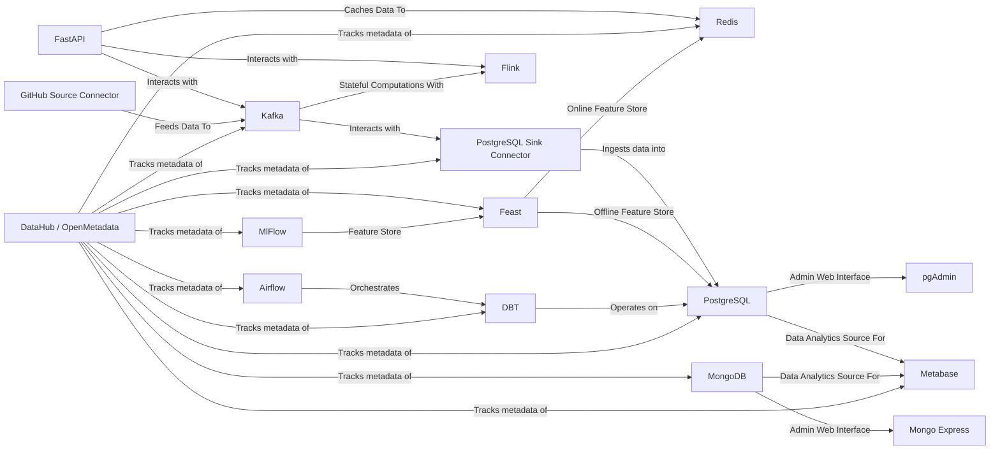

# PLACEHOLDER PAGE

This page will get replaced with the README.md file when the docs are deployed.

```mermaid
graph LR
    A[FastAPI] -->|Caches Data To| B[Redis]
    A -->|Interacts with| D[Kafka]
    F[GitHub Source Connector] -->|Feeds Data To| D
    D -->|Interacts with| E[PostgreSQL Sink Connector]
    E -->|Ingests data into| L[PostgreSQL]
    U -->|Offline Feature Store| L
    L -->|Admin Web Interface| M[pgAdmin]
    A -->|Interacts with| G
    D -->|Stateful Computations With| G[Flink]
    L -->|Data Analytics Source For| K[Metabase]
    I[MongoDB] -->|Admin Web Interface| J[Mongo Express]
    I -->|Data Analytics Source For| K
    O[Airflow] -->|Orchestrates| P[DBT]
    P -->|Operates on| L
    Q[DataHub / OpenMetadata] -->|Tracks metadata of| B
    Q -->|Tracks metadata of| I
    Q -->|Tracks metadata of| L
    Q -->|Tracks metadata of| K
    Q -->|Tracks metadata of| O
    Q -->|Tracks metadata of| T[MlFlow]
    Q -->|Tracks metadata of| E
    Q -->|Tracks metadata of| D
    Q -->|Tracks metadata of| P
    Q -->|Tracks metadata of| U
    T -->|Feature Store| U[Feast]
    U -->|Online Feature Store| B
```
